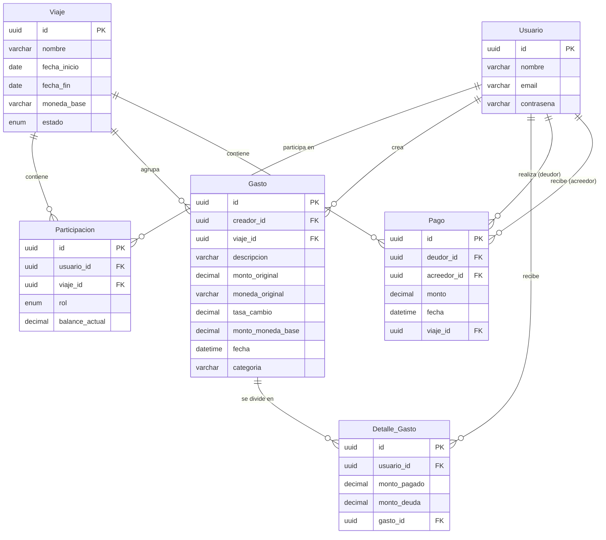

# Arquitectura y Diseño de Sistemas
# Informe: Primer Entrega

**Grupo 11:**

| Nombre | L.U. |
|---|---|
| Orellano, Rocio | 138873 |
| Paoloni, Rocco | 141851 |
| Robaina, Malena | 136259 |
| Rojas Fritz, Camila | 134332 |
| Seitz, Enrique | 138901 |

**Dominio del Sistema:** Sistema de gestión de gastos de viajes compartidos  
**Primer Entrega:** 6 de abril

---

## Descripción del sistema

El sistema consiste en una aplicación para **gestionar gastos compartidos** durante viajes en grupo. Permite **registrar gastos**, **dividirlos** entre participantes, **calcular** balances y facilitar la **resolución de deudas** entre los miembros.

El sistema está pensado para múltiples usuarios interactuando sobre viajes compartidos, con procesamiento de datos y posible integración con APIs externas (por ejemplo, tipo de cambio).

---

## Modelo de Dominio

### Entidades principales

#### Usuario

Representa a la persona registrada en la plataforma.

**Atributos:**
- id
- nombre
- email
- contraseña

**Relaciones:**
- Pertenece a cero o muchos Viajes.
- Puede ser "Pagador" de muchos Gastos.
- Puede ser "Deudor" (estar involucrado) en muchos Gastos.
- Realiza o recibe pagos.

---

#### Viaje

Es el contexto o contenedor donde ocurren los gastos compartidos.

**Atributos:**
- id
- nombre
- destino
- fechaInicio
- fechaFin
- monedaBase
- estado (activo / finalizado)

**Relaciones:**
- Un viaje tiene muchos Gastos
- Un viaje tiene muchas Participaciones

---

#### Participación (relación Usuario–Viaje)

**Atributos:**
- id
- rol (creador / supervisor / usuario)
- balanceActual

**Relaciones:**
- Un Usuario tiene cero o muchas Participaciones
- Un Usuario tiene cero o muchos Gastos
- Un Usuario tiene cero o muchos Detalles de gasto
- Un Usuario tiene cero o muchos Pagos

---

#### Gasto

**Atributos:**
- id
- descripción
- monto
- moneda
- fecha
- categoría

**Relaciones:**
- Un Gasto tiene un Viaje.
- Un Gasto tiene un Usuario.
- Un Gasto tiene muchos Detalles de Gasto

---

#### Detalle de Gasto

**Atributos:**
- id
- montoAsignado

**Relaciones:**
- Un detalle de gasto tiene un Gasto
- Un detalle de gasto tiene un Usuario

---

#### Pago

**Atributos:**
- id
- monto
- fecha

**Relaciones:**
- Un Pago tiene un Viaje
- Un Pago tiene un deudor (Usuario)
- Un Pago tiene un acreedor (Usuario)

---

## Reglas de negocio

**RN01** - Los balances se calculan en batch al seleccionar mostrar la preview o al finalizar el viaje.

**RN02** - Solo el administrador del viaje puede cerrarlo, eliminar o agregar participantes.

**RN03** - Cada viaje debe definir una moneda base única. Todos los reportes de deuda final se calcularán en esta moneda para evitar inconsistencias por fluctuación cambiaria.

**RN03** - Simplificación de Deudas: El sistema debe minimizar el número de transacciones. Si A debe a B, y B debe a C, el sistema debe sugerir que A pague a C directamente, siempre que los montos lo permitan.

**RN04** - Para que un usuario sea eliminado un usuario de un viaje, su deuda debe ser 0.

**RN05** - Para que un usuario salga de un viaje, el balance debe ser 0. (lo que debe y lo que le deben)

---

## Requerimientos Funcionales

Las HU completas están en un archivo aparte llamado "HU Requerimientos Funcionales".

### Gestión de usuarios

- **RF01** - Como usuario, quiero registrarme para usar la aplicación.
- **RF02** - Como usuario, quiero iniciar sesión.
- **RF03** - Como usuario, quiero editar mi perfil.

### Pagos

- **RF04** - Como usuario, quiero registrar un pago a otro usuario.
- **RF05** - Como usuario, quiero ver el historial de pagos.

### Gestión de viajes

- **RF06** - Como usuario, quiero crear un viaje.
- **RF07** - Como creador, quiero invitar personas a un viaje.
- **RF08** - Como creador, quiero eliminar personas a un viaje.
- **RF09** - Como creador, quiero finalizar un viaje.
- **RF10** - Como usuario, quiero ver los viajes en los que participo.
- **RF11** - Como usuario, quiero salir de un viaje.

### Procesos automáticos

- **RF12** - Como sistema, quiero recalcular balances al recibir una petición del usuario.

### Gestión de gastos

- **RF13** - Como usuario, quiero registrar un gasto.
- **RF14** - Como usuario, quiero editar o eliminar un gasto propio.
- **RF15** - Como usuario, quiero ver el historial de gastos del viaje.

### Integración externa

- **RF16** - Como sistema, quiero obtener tipos de cambio desde una API externa.

### Balances y deudas

- **RF17** - Como usuario, quiero ver cuánto debo y cuánto me deben.
- **RF18** - Como usuario, quiero ver el balance general del grupo.

---

## Requerimientos No Funcionales

### Arquitectura

**RNF01** - El sistema debe ser distribuido (frontend, backend y base de datos).

### Performance

**RNF02** - El cálculo de balances debe ejecutarse en menos de 30 segundos incluso para grupos con más de 1000 transacciones registradas.

**RNF03** - El sistema debe responder en menos de 30 segundos en operaciones comunes.

### Seguridad

**RNF04** - Control de acceso a recursos: un usuario solo debe poder visualizar y modificar los gastos de los viajes en los que participa y de acuerdo a su rol en el mismo.

### Escalabilidad

**RNF05** - El sistema debe soportar múltiples viajes simultáneos.

### Disponibilidad

**RNF06** - El sistema debe estar disponible al menos el 99% del tiempo.

### Mantenibilidad

**RNF07** - Código estructurado siguiendo principios SOLID.

**RNF08** - Separación clara de responsabilidades.

### Usabilidad e Interfaces

**RNF09** - Diseño Responsive (Mobile-First): Dado que es una app de viajes, la gente la usará principalmente desde el celular mientras está en el destino. El frontend debe adaptarse a pantallas móviles, tablets y escritorio.

---

## Roles Definidos

### Creador del viaje (Admin)

Es el usuario responsable de la creación del grupo. Posee el mayor nivel de permisos dentro del mismo.

**Permisos:**
- Crear el viaje
- Invitar usuarios al viaje
- Eliminar usuarios del viaje
- Eliminar el viaje
- (Opcional) Modificar roles de otros usuarios

---

### Supervisor

Este rol tiene como objetivo la supervisión de la información sin posibilidad de modificarla.

**Permisos:**
- Visualizar los gastos registrados
- Consultar balances y deudas entre usuarios

**Restricciones:**
- No puede agregar, editar ni eliminar gastos
- No puede modificar la estructura del grupo

---

### Usuario (Miembro)

Corresponde a los participantes activos del grupo.

**Permisos:**
- Registrar nuevos gastos
- Participar en la división de gastos

**Restricciones:**
- No puede eliminar el grupo
- No puede gestionar usuarios

---

## Integración de API de Conversión de Moneda

El sistema incorpora la integración con una API externa de conversión de monedas, similar a las utilizadas en aplicaciones como Splitwise, con el objetivo de permitir la gestión de gastos en múltiples divisas dentro de un mismo grupo.

Esta funcionalidad resulta especialmente útil en contextos como viajes internacionales, donde los participantes pueden realizar gastos en diferentes monedas. Para garantizar la coherencia en los cálculos, el sistema define una **moneda base por grupo**, en la cual se unifican todos los importes.

### Funcionamiento

Cuando un usuario registra un gasto, el sistema realiza el siguiente proceso:

1. Se ingresa el monto y la moneda original del gasto
2. El sistema consulta una API de conversión de moneda (por ejemplo, ExchangeRate API)
3. Se obtiene la tasa de cambio actual respecto a la moneda base del grupo
4. Se calcula el monto equivalente en la moneda base
5. Se almacenan tanto el valor original como el valor convertido

Este enfoque permite mantener trazabilidad sobre los datos originales y asegurar consistencia en los cálculos de balances.
