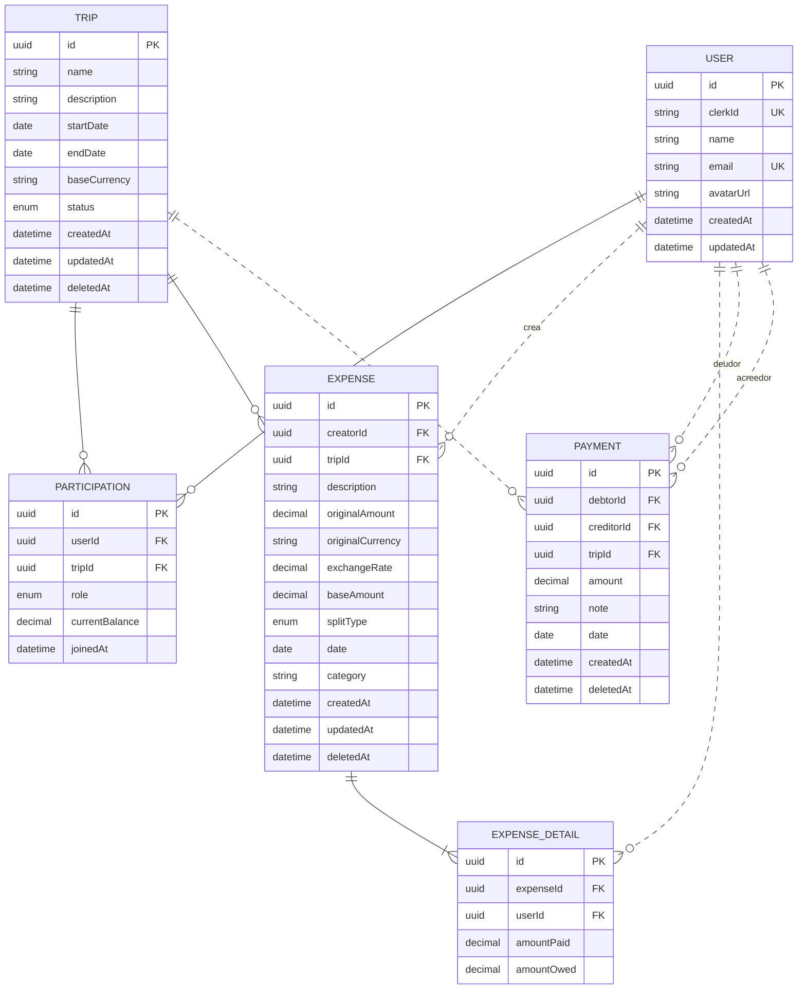

# Modelo de Datos - Cuentas Claras

## Diagrama



---

## Entidades Principales

### 1. **User** (usuarios)
Almacena información de los usuarios del sistema.

| Campo | Tipo | Restricciones | Descripción |
|-------|------|---|---|
| id | UUID | PK | Identificador único |
| clerkId | String | UNIQUE | ID de autenticación de Clerk |
| name | String | NOT NULL | Nombre del usuario |
| email | String | UNIQUE | Email del usuario |
| avatarUrl | String | NULL | URL del avatar |
| createdAt | DateTime | DEFAULT NOW() | Fecha de creación |
| updatedAt | DateTime | AUTO UPDATE | Fecha de última actualización |

**Relaciones:**
- Participa en múltiples Viajes (vía `Participation`)
- Crea múltiples Gastos (`createdExpenses`)
- Participa en detalles de gastos (`expenseDetails`)
- Debe dinero a otros usuarios (`debtsOwed` vía `Payment`)
- Le deben dinero otros usuarios (`debtsReceived` vía `Payment`)

---

### 2. **Trip** (viajes)
Representa un viaje donde se comparten gastos.

| Campo | Tipo | Restricciones | Descripción |
|-------|------|---|---|
| id | UUID | PK | Identificador único |
| name | String | NOT NULL | Nombre del viaje |
| description | String | NULL | Descripción del viaje |
| startDate | Date | NULL | Fecha de inicio |
| endDate | Date | NULL | Fecha de fin |
| baseCurrency | String | NOT NULL | Moneda base del viaje |
| status | TripStatus | DEFAULT ACTIVE | Estado: ACTIVE \| FINALIZED |
| createdAt | DateTime | DEFAULT NOW() | Fecha de creación |
| updatedAt | DateTime | AUTO UPDATE | Fecha de última actualización |
| deletedAt | DateTime | NULL, INDEX | Soft delete |

**Relaciones:**
- Tiene múltiples Participantes (`participations`)
- Tiene múltiples Gastos (`expenses`)
- Tiene múltiples Pagos (`payments`)

---

### 3. **Participation** (participaciones)
Tabla de unión que registra la participación de usuarios en viajes.

| Campo | Tipo | Restricciones | Descripción |
|-------|------|---|---|
| id | UUID | PK | Identificador único |
| userId | UUID | FK, NOT NULL | Usuario participante |
| tripId | UUID | FK, NOT NULL | Viaje |
| role | ParticipationRole | DEFAULT MEMBER | Rol: CREATOR \| SUPERVISOR \| MEMBER |
| currentBalance | Decimal(12,2) | DEFAULT 0 | Saldo actual del usuario en el viaje |
| joinedAt | DateTime | DEFAULT NOW() | Fecha de unión |

**Restricciones:**
- UNIQUE(userId, tripId): Un usuario solo puede participar una vez por viaje
- FK userId → User (CASCADE DELETE)
- FK tripId → Trip (CASCADE DELETE)

**Relaciones:**
- Referencia a User
- Referencia a Trip

---

### 4. **Expense** (gastos)
Registra gastos compartidos en un viaje.

| Campo | Tipo | Restricciones | Descripción |
|-------|------|---|---|
| id | UUID | PK | Identificador único |
| creatorId | UUID | FK, NOT NULL | Usuario que registra el gasto |
| tripId | UUID | FK, NOT NULL | Viaje asociado |
| description | String | NULL | Descripción del gasto |
| originalAmount | Decimal(12,2) | NOT NULL | Monto original |
| originalCurrency | String | NOT NULL | Moneda original |
| exchangeRate | Decimal(12,6) | NULL | Tasa de cambio aplicada |
| baseAmount | Decimal(12,2) | NULL | Monto convertido a moneda base |
| splitType | ExpenseSplitType | DEFAULT EQUAL | Tipo de división: EQUAL \| EXACT \| PERCENT |
| date | DateTime | DEFAULT NOW() | Fecha del gasto |
| category | String | NULL | Categoría del gasto |
| createdAt | DateTime | DEFAULT NOW() | Fecha de creación |
| updatedAt | DateTime | AUTO UPDATE | Fecha de última actualización |
| deletedAt | DateTime | NULL, INDEX | Soft delete |

**Restricciones:**
- FK creatorId → User
- FK tripId → Trip (CASCADE DELETE)
- INDEX tripId, creatorId, deletedAt

**Relaciones:**
- Referencia a User (creador)
- Referencia a Trip
- Tiene múltiples ExpenseDetails

---

### 5. **ExpenseDetail** (detalles de gasto)
Tabla de desglose que especifica cuánto debe pagar/pagó cada usuario en un gasto.

| Campo | Tipo | Restricciones | Descripción |
|-------|------|---|---|
| id | UUID | PK | Identificador único |
| expenseId | UUID | FK, NOT NULL | Gasto asociado |
| userId | UUID | FK, NOT NULL | Usuario |
| amountPaid | Decimal(12,2) | DEFAULT 0 | Monto que pagó |
| amountOwed | Decimal(12,2) | DEFAULT 0 | Monto que debe |

**Restricciones:**
- UNIQUE(expenseId, userId): Un usuario solo aparece una vez por gasto
- FK expenseId → Expense (CASCADE DELETE)
- FK userId → User

**Relaciones:**
- Referencia a Expense
- Referencia a User

---

### 6. **Payment** (pagos)
Registra pagos entre usuarios para liquidar deudas.

| Campo | Tipo | Restricciones | Descripción |
|-------|------|---|---|
| id | UUID | PK | Identificador único |
| debtorId | UUID | FK, NOT NULL | Usuario que debe |
| creditorId | UUID | FK, NOT NULL | Usuario que recibe |
| tripId | UUID | FK, NOT NULL | Viaje asociado |
| amount | Decimal(12,2) | NOT NULL | Monto pagado |
| note | String | NULL | Nota o referencia |
| date | DateTime | DEFAULT NOW() | Fecha del pago |
| createdAt | DateTime | DEFAULT NOW() | Fecha de creación |
| deletedAt | DateTime | NULL, INDEX | Soft delete |

**Restricciones:**
- FK debtorId → User
- FK creditorId → User
- FK tripId → Trip (CASCADE DELETE)
- INDEX tripId, deletedAt

**Relaciones:**
- Referencia a User (deudor)
- Referencia a User (acreedor)
- Referencia a Trip

---

## Enumeraciones

### TripStatus
- **ACTIVE**: Viaje activo
- **FINALIZED**: Viaje finalizado

### ParticipationRole
- **CREATOR**: Creador del viaje
- **SUPERVISOR**: Supervisor con permisos especiales
- **MEMBER**: Miembro regular

### ExpenseSplitType
- **EQUAL**: División equitativa entre todos
- **EXACT**: Montos específicos por usuario
- **PERCENT**: Porcentajes de división

---

## Análisis de Normalización (3FN)

### Cumplimiento General del Esquema

La mayoría del esquema de Cuentas Claras cumple correctamente con 3FN. Las tablas `User`, `Trip`, `Payment`, y `ExpenseDetail` están completamente normalizadas

**Sin embargo, existen dos excepciones intencionales** donde se han introducido denormalizaciones estratégicas:

---

### Denormalización 1: `Participation.currentBalance`

#### Descripción Técnica de la Violación

El campo `currentBalance` en la tabla `Participation` **viola 3FN porque es un atributo derivado con dependencia transitiva**.

**Cadena de dependencias:**
```
Participation.id (clave primaria)
    ↓
Participation.currentBalance (atributo no clave DERIVADO)
    ↓
Depende transitivamente de:
    - ExpenseDetail.amountOwed (para este usuario en este viaje)
    - ExpenseDetail.amountPaid (para este usuario en este viaje)
    - Payment.amount (pagos entre usuarios en este viaje)
```

**La lógica matemática del campo:**
```
currentBalance = 
    SUM(ExpenseDetail.amountOwed para este userId en este tripId)
    - SUM(ExpenseDetail.amountPaid para este userId en este tripId)
    + SUM(Payment.amount donde creditorId = este userId)
    - SUM(Payment.amount donde debtorId = este userId)
```

Este valor puede ser recalculado en cualquier momento consultando `ExpenseDetail` y `Payment`, por lo que técnicamente violaría 3FN.

#### ¿Por Qué se Denormalizó?

**Problema de rendimiento sin denormalización:**

Sin `currentBalance` cacheado, cada consulta de saldo requeriría:

1. **Query compleja con múltiples JOINs:**
   - JOIN con ExpenseDetail (miles de registros si hay muchos gastos)
   - JOIN con Payment (cientos de registros por viaje)
   - Agregaciones y cálculos en la aplicación

2. **Impacto en casos de uso críticos:**
   - Dashboard: Mostrar balances de todos los participantes → N queries complejas
   - Liquidación de deudas: Calcular quién debe a quién → queries muy costosas
   - Estado del viaje: Mostrar resumen financiero → múltiples agregaciones

3. **Escala del problema:**
   - Un viaje con 20 personas y 500 gastos requeriría recalcular 20 balances
   - Cada balance necesita sumar ~500 registros de ExpenseDetail
   - Más payments registrados = más registros a procesar

#### Justificación del Trade-Off

**Ventajas de la denormalización:**
- Queries de saldo O(1) - acceso directo a un campo
- Dashboard responsive - sin cálculos costosos
- Escalable - performance no degrada con número de gastos
- Experiencia de usuario - balances instantáneos

**Solución implementada:**
Este campo se actualiza mediante:
- Triggers en la base de datos cuando se crea/modifica `ExpenseDetail`
- Triggers cuando se crea `Payment`
- Recálculo completo en operaciones batch críticas (liquidación de viaje)

---

### Denormalización 2: `Expense.baseAmount`

#### Descripción Técnica de la Violación

El campo `baseAmount` en la tabla `Expense` **viola 3FN porque es un atributo derivado/calculado**.

**Cadena de dependencias:**
```
Expense.id (clave primaria)
    ↓
Expense.baseAmount (atributo no clave DERIVADO)
    ↓
Depende transitivamente de:
    - Expense.originalAmount (valor base)
    - Expense.exchangeRate (factor de conversión)
```

**La lógica matemática del campo:**
```
baseAmount = originalAmount × exchangeRate
```

#### ¿Por Qué se Denormalizó?

**Problema sin denormalización:**

1. **Múltiples conversiones de moneda en cada consulta:**
   - Un viaje puede tener gastos en EUR, USD, JPY, MXN, etc.
   - Trip tiene `baseCurrency` - todos los cálculos deben estar en esa moneda
   - Cada reporte, cada saldo, cada consolidación debe convertir

2. **Overhead computacional:**
   ```
   Para obtener gasto total en moneda base:
   SELECT SUM(originalAmount * exchangeRate) FROM Expense
   ```
   Esto requiere operación de punto flotante en cada fila

3. **Riesgos de cálculo inconsistente:**
   - Sin cache, diferentes procesos podrían calcular conversiones levemente diferentes
   - La tasa de cambio debe ser la EXACTA del momento del gasto (histórica)

4. **Casos de uso que sufren:**
   - Reporte de gastos por categoría en moneda base → múltiples conversiones
   - Dashboard de montos totales → conversión en cada query
   - Cálculo de deudas consolidadas → conversión en cada fila
   - Exportación de reportes → cálculos masivos

#### Justificación del Trade-Off

**Ventajas de la denormalización:**
- Cálculos de reportes O(1) por fila - suma directa
- Consistencia garantizada - la conversión se fija al crear el gasto
- Auditoría clara - se puede ver exactamente qué tasa se usó
- Performance - evita operaciones de punto flotante repetidas

**Solución implementada:**
- El campo se calcula e inserta en el momento de crear el `Expense`
- La tasa de cambio se obtiene del servicio externo en tiempo de creación
