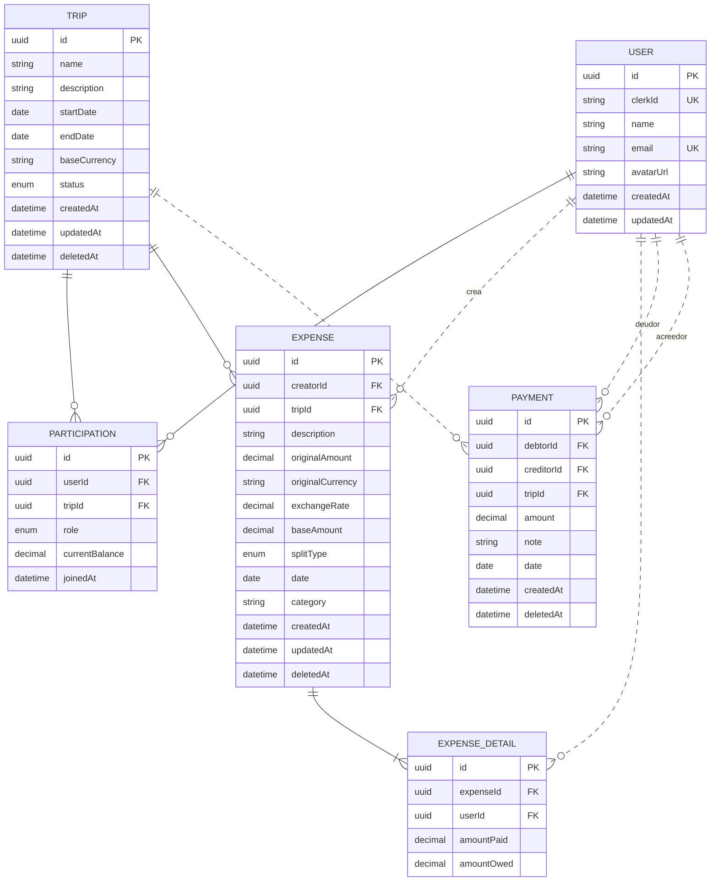

# Diagrama de Entidad-Relación - Cuentas Claras

## Modelo de Datos

## Leyenda de Relaciones

- **||--o{** → Uno a muchos (línea sólida - relación identificadora)
- **||..o{** → Uno a muchos (línea punteada - relación no identificadora)
- **||--|{** → Uno a muchos (línea sólida - relación identificadora)

## Claves y Restricciones

- **PK** → Primary Key (Clave Primaria)
- **FK** → Foreign Key (Clave Foránea)
- **UK** → Unique Key (Clave Única)

## Descripción del Modelo

### Flujos principales de datos:

1. **Viajes y Participantes**: Un `USER` participa en múltiples `TRIP`s mediante `PARTICIPATION`. Cada participación tiene un rol (CREATOR, SUPERVISOR, MEMBER) y un balance actual.

2. **Gastos Compartidos**: Dentro de cada `TRIP`, se registran `EXPENSE`s. Cada gasto tiene un creador (`USER`), monto original en moneda local, y puede convertirse a la moneda base del viaje.

3. **División de Gastos**: Cada `EXPENSE` tiene múltiples `EXPENSE_DETAIL`s que definen cómo se divide entre los participantes (amountPaid vs amountOwed).

4. **Liquidación de Deudas**: Los `PAYMENT`s representan transacciones entre usuarios para liquidar deudas generadas por los gastos compartidos.
